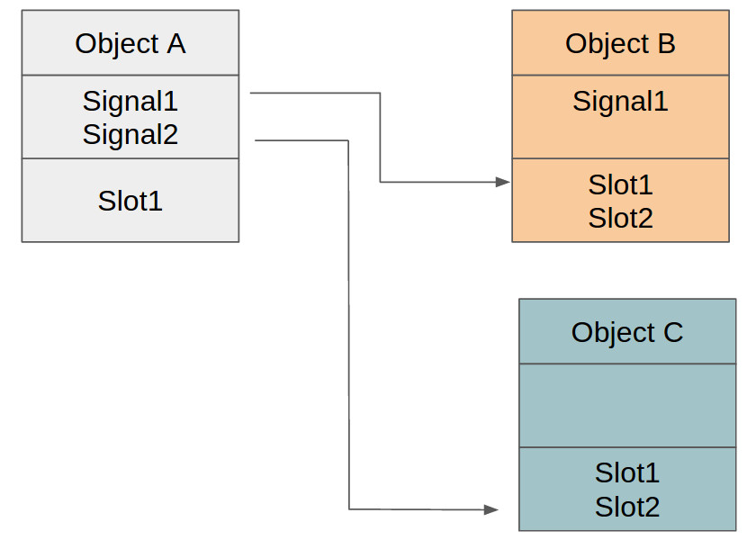
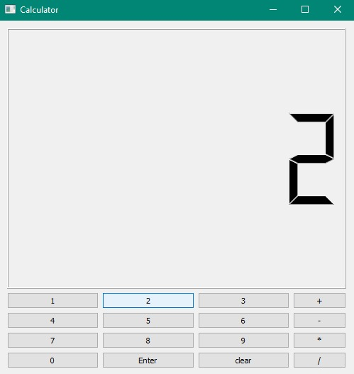
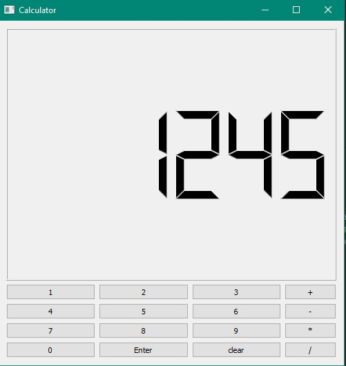
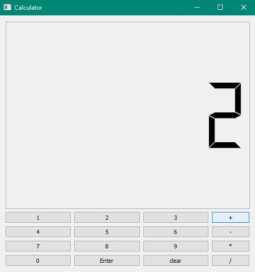
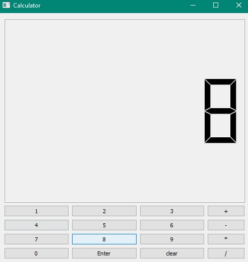
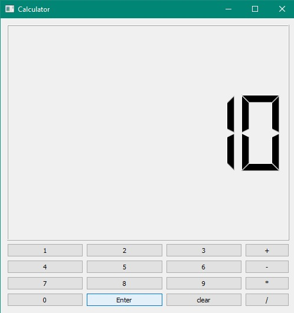
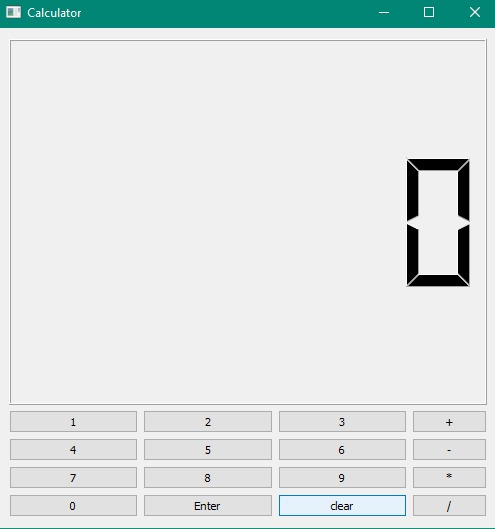
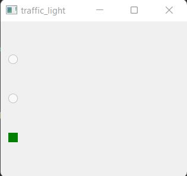
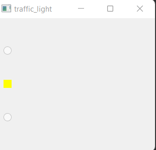
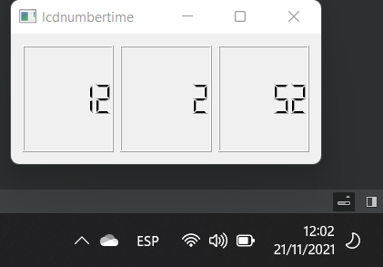

<!--heading-->

# SIGNALS & SLOTS

## Introduction 

- In GUI programming, when we change one widget, we often want another widget to be notified. More generally, we want objects of any kind to be able to communicate with one another. For example, if a user clicks a Close button, we probably want the window's close() function to be called.

- Other toolkits achieve this kind of communication using callbacks. A callback is a pointer to a function, so if you want a processing function to notify you about some event you pass a pointer to another function (the callback) to the processing function. The processing function then calls the callback when appropriate. While successful frameworks using this method do exist, callbacks can be unintuitive and may suffer from problems in ensuring the type-correctness of callback arguments.

## S & S </em>
 - In Qt, we have an alternative to the callback technique: We use signals and slots. A signal is emitted when a particular event occurs. Qt's widgets have many predefined signals, but we can always subclass widgets to add our own signals to them. A slot is a function that is called in response to a particular signal. Qt's widgets have many pre-defined slots, but it is common practice to subclass widgets and add your own slots so that you can handle the signals that you are interested in.



## Sections 

 +[Calculator]() 
- [Setup]() 
- [Custom Slots]() 
- [Digits Interaction]() 
- [Integer numbers]() 
- [Operation Interaction]()
- [Enter Button]()
- [Enhancements]()

 +[Traffic Light]()
 +[LCDnumber]()

 # Calculator
 The gool of this exercice is to complete all the function that we need to simulate a basic calculator behavior

 ## Setup 
  - In this part we will run our application ...  and as we see the application has no reactivity 

first thing we will represent any mathematical operation by :
left (op) right  
 
  op : id one of the operation (+ / - / * /) 

  so now we need to add private members to our calculator.h 
```cpp
private :
  int * left;
    int * right;
    QString *operation;
``` 

 ## Custom Slots
  In this part we will use the Sender approach which allow a slot to get the identity of the sender object (if we respond to each digit click we will  face a classical problem which to map multiple signals to the same slot )
  ```
  public slots:
   void newDigit();
   ```

## Digits Interaction

This is the best part when we connect all  the button to this slot , This function will use the Sender method to get the identity of which button was clicked 
 ## connect all the digits buttons to this slot
 ``` cpp
 void Calculator::makeConnexions()
{
    for(int i=0; i <10; i++)
         connect(digits[i], &QPushButton::clicked,
                 this, &Calculator::newDigit);
```
###  implement the newDigit slot to show the digit in the LCDNumber
```cpp
void Calculator::changeOperation()
{
    //Getting the sender button
    auto button = dynamic_cast<QPushButton*>(sender());

    //Storing the operation
    operation = new QString{button->text()};

    //Initiating the right button
    right = new int{0};

    //reseting the display
    disp->display(0);
}
```
 # RESULTS 

 

 ## Integer numbers
 - Now that we can react to each digit, it is time to correctly implement the newDigit slot

- We should clarify two points to clearly understand the implementation
  - Which number, should be constructing left or right
  - How to add digit to an existing number

After answering we got this full implementation
```cpp
void Calculator::newDigit( )
{
    //getting the sender
    auto button = dynamic_cast<QPushButton*>(sender());

    //getting the value
    int value = button->text().toInt();

    //Check if we have an operation defined
    if(operation)
    {
        //check if we have a value or not
        if(!right)
            right = new int{value};
        else
            *right = 10 * (*right) + value;

        disp->display(*right);

    }
    else
    {
        if(!left)
            left = new int{value};
        else
            *left = 10 * (*left) + value;

        disp->display(*left);
    }
}
```
## RESULTS
 
 ## Operation Interaction
- Now we will move on the operation of the four buttons.
  - we will define a single slot to handle the click on the operations buttons
  ```cpp 
  public slots:
    void changeOperation();  
    void newDigit();
    ```
        
    This slot will simply execute the following operations:
    - Get the identity of the sender button.
    - Store the clicked operation.
    -  Reset the display to 0
    ```cpp
    void Calculator::changeOperation() {
 
  
     //Getting the sender button
    auto button = dynamic_cast<QPushButton*>(sender());

    //Storing the operation
    operation = new QString{button->text()};

    //Initiating the right button
    right = new int{0};

    //reseting the display
    disp->display(0); }
    ```

# Enter Button

 And this the final touch that we make as having fun with our calculator
 -  we should to implement the slot for the enter button to compute the result of combining the left and right value according to the operation
 
  After the implementation we have the final result  or our code

  - Calculator.h
  ```cpp
  #ifndef CALCULATOR_H
#define CALCULATOR_H

#include <QMainWindow>
#include <QGridLayout>
#include <QVector>
#include <QPushButton>
#include <QLCDNumber>

class Calculator : public QWidget
{
    Q_OBJECT
public:
    Calculator(QWidget *parent = nullptr);
    ~Calculator();

 // Add you custom slots here
protected:
    void createWidgets();        //Function to create the widgets
    void placeWidget();         // Function to place the widgets
    void makeConnexions();
   // Create all the connectivity
    void keyPressEvent(QKeyEvent *e)override;


private:
    QGridLayout *buttonsLayout;
    QVBoxLayout *layout;
    QVector<QPushButton*> digits;

    QPushButton *enter;
    QPushButton *clear;
    QVector<QPushButton*> operations;
    QLCDNumber *disp;

   int * left;
    int * right;
    QString *operation;


public slots:
  void newDigit();
  void changeOperation();
  void op();
 void clearHistory();

};
#endif
```

- Calculator.cpp
```cpp
#include "calculator.h"
#include <QKeyEvent>
#include <QApplication>
#include "math.h"

Calculator::Calculator(QWidget *parent)
    : QWidget(parent)
{
    createWidgets();
    placeWidget();
    makeConnexions();
    op();
    clearHistory();


left=nullptr;
right=nullptr;
operation=nullptr;

}

void Calculator::clearHistory(){
         disp->display(0);
          delete left;
         left = nullptr;
         delete right;
          right = nullptr;
       delete operation;
        operation = nullptr;

}

Calculator::~Calculator()
{

       // delete disp;
        delete layout;
        delete buttonsLayout;
        delete enter;
        delete disp;
        delete left;
        delete right;
        delete operation;
    delete clear;


    }


void Calculator::createWidgets()
{
    //Creating the layouts
    layout = new QVBoxLayout();
  //->->  layoutH= new QHBoxLayout();
    layout->setSpacing(5);


    //grid layout
    buttonsLayout = new QGridLayout;

   //->-> clear= new QPushButton("clear");

    //creating the buttons
    for(int i=0; i < 10; i++)
    {
        digits.push_back(new QPushButton(QString::number(i)));
        digits.back()->setSizePolicy(QSizePolicy::Expanding, QSizePolicy::Fixed);
        digits.back()->resize(sizeHint().width(), sizeHint().height());
    }
    //enter button
    enter = new QPushButton("Enter",this);
    clear= new QPushButton("clear",this);
    //enter->setSizePolicy(QSizePolicy::Expanding, QSizePolicy::Fixed);
    enter->resize(sizeHint().width(), sizeHint().height());


    //operatiosn buttons
    operations.push_back(new QPushButton("+"));
    operations.push_back(new QPushButton("-"));
    operations.push_back(new QPushButton("*"));
    operations.push_back(new QPushButton("/"));


    //creating the lcd
    disp = new QLCDNumber(this);
    disp->setDigitCount(6);


}

void Calculator::placeWidget()
{

    layout->addWidget(disp);
   // layout1->addWidget(clear);
    layout->addLayout(buttonsLayout);
   //layout->addLayout(layout1);


    //adding the buttons
    for(int i=1; i <10; i++)
        buttonsLayout->addWidget(digits[i], (i-1)/3, (i-1)%3);


    //Adding the operations
    for(int i=0; i < 4; i++)
        buttonsLayout->addWidget(operations[ i], i, 4);


    //Adding the 0 button
    buttonsLayout->addWidget(digits[0], 3, 0);
    buttonsLayout->addWidget(enter, 3, 1, 1,1);
    buttonsLayout->addWidget(clear, 3, 2, 1,1);


    setLayout(layout);
}


void Calculator::newDigit( )
{
    //getting the sender
    auto button = dynamic_cast<QPushButton*>(sender());

    //getting the value
    auto value = button->text().toInt();

    //Check if we have an operation defined
    if(operation)
    {
        //check if we have a value or not
        if(!right)
            right = new int{value};
        else
            *right = 10 * (*right) + value;

        disp->display(*right);

    }
    else
    {
        if(!left)
            left = new int{value};
        else
            *left = 10 * (*left) + value;

        disp->display(*left);
    }
}
//addition//

void Calculator::makeConnexions()
{
    for(int i=0; i <10; i++)
         connect(digits[i], &QPushButton::clicked,
                 this, &Calculator::newDigit);
    for(int i=0; i < 4; i++)
        connect(operations[i], &QPushButton::clicked,
                this, &Calculator::changeOperation);

connect(enter,&QPushButton::clicked,this, &Calculator:: op );
connect(clear,&QPushButton::clicked,this,&Calculator::clearHistory);
}

void Calculator::op(){

   if( operation==operations[0]->text()){
       disp->display(*left + (*right));

   }
   else if( operation== operations[1]->text()){
       disp->display(*left - *right);
   }
   else if( operation== operations[2]->text()){
       disp->display((*left) * (*right));
   }
   else if( operation== operations[3]->text()){
       disp->display(*left / *right);
 }}


void Calculator::changeOperation()
{
    //Getting the sender button
    auto button = dynamic_cast<QPushButton*>(sender());

    //Storing the operation
    operation = new QString{button->text()};

    //Initiating the right button
    right = new int{0};

    //reseting the display
    disp->display(0);
}

void Calculator::keyPressEvent(QKeyEvent *e)
{
    //Exiting the application by a click on space
    if( e->key() == Qt::Key_Escape)
        qApp->exit(0);
  


    
}
```

 - Main.cpp
 ```cpp
 #include "calculator.h"

#include <QApplication>

int main(int argc, char *argv[])
{
    QApplication a(argc, argv);
    Calculator w;
    w.setWindowTitle("Calculator");
    w.resize(500,500);
    w.show();
    return a.exec();
}
```
## RESULTS





 # Traffic Light
  - In this exercise, we will use the QTimer to simulate a traffic light
     
       to realise our exercice we need to :
      
       - Investigate the code in order to underhand each component of the TrafficLight class.

    - Your task is add some functions in order to change each 3 sedonds in the following order :  Red -> Green -> Yellow

    And we have the following codes 

 
  - trafficlight.h
  ```cpp
  #ifndef TRAFFIC_LIGHT_H
#define TRAFFIC_LIGHT_H

#include <QWidget>
#include<QTimerEvent>
#include<QTime>
#include<QKeyEvent>
#include<QLabel>
class QRadioButton;

class TrafficLight: public QWidget{
  Q_OBJECT

public:

  TrafficLight(QWidget * parent = nullptr);

protected:
     void createWidgets();
     void placeWidgets();
     void timerEvent(QTimerEvent *e) override;
     void keyPressEvent(QKeyEvent *e) override;


private:

  QRadioButton * redlight;
  QRadioButton * yellowlight;
  QRadioButton * greenlight;
  //QVector<QRadioButton*> lights;
  //int index;
  //QLabel *letter;
  //int times[3]=  {3,3,3};
  int currentTime;

};


#endif
```
 - trafficlight.cpp
 ```cpp
 #include "trafficlight.h"
#include <QWidget>
#include <QLayout>
#include <QRadioButton>
#include<QApplication>
TrafficLight::TrafficLight(QWidget * parent): QWidget(parent){

    //Creatign the widgets
    createWidgets();

    //place Widgets
    placeWidgets();

}
void TrafficLight::keyPressEvent(QKeyEvent *e){
    if(e->key() == Qt::Key_Escape)
        qApp->exit();
   // else
     //   letter->setText(e->text());
    if(e->key() == Qt::Key_G){
        greenlight->toggle();}
    if(e->key() == Qt::Key_R){
        redlight->toggle();}
    if(e->key() == Qt::Key_Y){
        yellowlight->toggle();}
}
void TrafficLight::createWidgets()
{
//letter=new QLabel(this);
//letter->setFont(QFont("monospace",50));
  redlight = new QRadioButton;
  redlight->setEnabled(false);
  redlight->toggle();
  redlight->setStyleSheet("QRadioButton::indicator:checked { background-color: red;}");

  yellowlight = new QRadioButton;
  yellowlight->setEnabled(false);
  yellowlight->setStyleSheet("QRadioButton::indicator:checked { background-color: yellow;}");

  greenlight = new QRadioButton;
  greenlight->setEnabled(false);
  greenlight->setStyleSheet("QRadioButton::indicator:checked { background-color: green;}");
 startTimer(2000);
 currentTime=0;
 //index=0;
 //lights.append(redlight);
 //lights.append(yellowlight);
//lights.append(greenlight);
}

void TrafficLight::timerEvent(QTimerEvent *e){
//index= (index+1)% 3;
//lights[index]->toggle();
    currentTime++;
    if(redlight->isChecked() && currentTime== 3){
        greenlight->toggle();
        currentTime=0;
    }
    if(greenlight->isChecked() && currentTime== 3){
        yellowlight->toggle();
        currentTime=0;
    }
    if(yellowlight->isChecked() && currentTime== 3){
        redlight->toggle();
        currentTime=0;
    }

}
void TrafficLight::placeWidgets()
{

  // Placing the widgets
  auto layout = new QVBoxLayout;
  layout->addWidget(redlight);
  layout->addWidget(yellowlight);
  layout->addWidget(greenlight);
  setLayout(layout);
}
```
- Main.cpp
```cpp
#include <QApplication>
#include "trafficlight.h"

int main(int argc, char *argv[])
{
    QApplication a(argc, argv);


    //Creating the traffic light
    auto light = new TrafficLight;


    //showing the trafic light
    light->show();

    return a.exec();
}
```
# Final Results




# LCDnumber
The QLCDNumber widget displays a number with LCD-like digits.

It can display a number in just about any size. It can display decimal, hexadecimal, octal or binary numbers. It is easy to connect to data sources using the display() slot, which is overloaded to take any of five argument types.


   - digitalmotre.h
   ```cpp
   #ifndef DIGITALMONTRE_H
#define DIGITALMONTRE_H

#include <QWidget>
#include<QTimerEvent>
#include<QLabel>
#include<QTime>
#include<QLCDNumber>
#include<QHBoxLayout>
class digitalmontre : public QWidget
{
    Q_OBJECT
public:
    explicit digitalmontre(QWidget *parent = nullptr);

protected:
     void timerEvent(QTimerEvent *e)override;
void createwidgets();
void placewidgets();
void updateTime();
private:
QLabel *time;
QLCDNumber *hour;
QLCDNumber *minute;
QLCDNumber *seconde;

};

#endif
```
-digitalmotre.cpp
```cpp
digitalmontre::digitalmontre(QWidget *parent) : QWidget(parent)
{
    createwidgets();
    placewidgets();
startTimer(1000);
}
void digitalmontre::updateTime(){
    auto t= QTime::currentTime();
    hour->display(t.hour());
    minute->display(t.minute());
    seconde->display(t.second());
}
void digitalmontre::timerEvent(QTimerEvent *e){
 updateTime();
}
void digitalmontre::createwidgets(){
hour= new QLCDNumber;
minute= new QLCDNumber;
seconde= new QLCDNumber;
auto t= QTime::currentTime();
hour->display(t.hour());
minute->display(t.minute());
seconde->display(t.second());
hour->setMinimumHeight(80);
minute->setMinimumHeight(80);
seconde->setMinimumHeight(80);
}
void digitalmontre::placewidgets(){
QLayout *layout= new QHBoxLayout;
layout->addWidget(hour);
layout->addWidget(minute);
layout->addWidget(seconde);
setLayout(layout);
}
```
- main.cpp
```cpp
#include <QApplication>
#include"digitalmontre.h"
int main(int argc, char *argv[])
{
    QApplication app(argc, argv);
auto p= new digitalmontre;
p->show();
    return app.exec();
}
```
  - We notice that we have the same time in the lcdnumber with our computer
# Result


# Conclusion 
In this section we learned a lot  of  valuable knowledge that made creating our program more enjoyable and we are excited to know what we will do for the next project.
